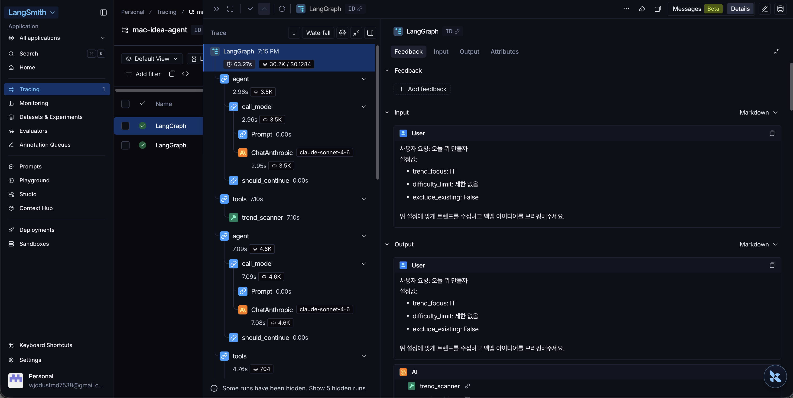

# mac-idea-agent

> **하찮은 맥앱 아이디어 브리핑 에이전트**
> 글로벌 밈 트렌드 × IT 트렌드를 교차 분석해 "귀엽고 하찮지만 실용적인" macOS 앱 아이디어를 자동으로 브리핑합니다.

7주차 AI 에이전트 구현 + 8주차 Observability 추가 — 6주차 설계서(`design_v2.md`)의 ReAct + Workflow/Agent 분리 구조를 LangGraph로 구현하고 LangSmith·로컬 trace를 결합한 결과물입니다.

---

## 1. 개요

매일 "오늘 뭐 만들지?"를 고민하는 1인 바이브코더(`이주임` 페르소나)를 타깃으로 하는 LangGraph 기반 ReAct 에이전트입니다.

**왜 단일 LLM 호출이 아니라 Agent인가**
- 학습 데이터에 없는 **오늘**의 Reddit·YouTube·HackerNews·GitHub 트렌드는 실시간 Tool 없이는 알 수 없음
- 트렌드 수집 → 컨셉 생성 → 유사 앱 검색 → 난이도 판단의 **고정 파이프라인은 Workflow**, 그 사이의 예외 분기(유사 앱 발견 시 루프백, 일부 소스 실패 시 진행 여부 등)만 **Agent의 동적 판단**이 필요

---

## 2. 아키텍처 — Workflow vs Agent 구간 분리

design_v2.md 멘토 피드백 반영: 정상 흐름은 Workflow가 처리, 예외·판단 분기점에만 Agent의 자율성을 제한적으로 부여.

```
━━━━━━━━━━━━━━━━━━━━━━━━━━━━━━━━━━━━━━━━━━━━
[GUARDRAIL — Tool 호출 이전 필터]
━━━━━━━━━━━━━━━━━━━━━━━━━━━━━━━━━━━━━━━━━━━━
  인젝션 패턴 / 도메인 외 요청 → Tool 호출 없이 즉시 거부

━━━━━━━━━━━━━━━━━━━━━━━━━━━━━━━━━━━━━━━━━━━━
[WORKFLOW — 고정 파이프라인 (정상 흐름)]
━━━━━━━━━━━━━━━━━━━━━━━━━━━━━━━━━━━━━━━━━━━━
Step 1. trend_scanner          → 트렌드 수집
Step 2. concept_generator      → 후보 컨셉 생성
Step 3. app_existence_checker  → 유사 앱 검색
Step 4. feasibility_checker    → 난이도 판단

━━━━━━━━━━━━━━━━━━━━━━━━━━━━━━━━━━━━━━━━━━━━
[AGENT — 예외 발생 시에만 개입]
━━━━━━━━━━━━━━━━━━━━━━━━━━━━━━━━━━━━━━━━━━━━
판단 1. similar_app_found=True       → concept_generator 재호출 (루프백)
판단 2. 트렌드 소스 partial_failure  → 나머지 소스만으로 계속 진행 여부
판단 3. difficulty_limit_exceeded    → 후보 컨셉 교체 여부
판단 4. loop_count >= 3              → 루프 탈출 + fallback

━━━━━━━━━━━━━━━━━━━━━━━━━━━━━━━━━━━━━━━━━━━━
[OBSERVABILITY — 8주차 추가]
━━━━━━━━━━━━━━━━━━━━━━━━━━━━━━━━━━━━━━━━━━━━
  LangSmith 자동 trace + 로컬 traces/{trace_id}.json 저장
  민감정보 마스킹, 토큰·latency 메트릭, prompt_version 기록
```

분리 원칙은 `src/prompts/system_prompt.py`에 [WORKFLOW] / [AGENT] 라벨로 명시되어 있고, LangGraph `create_react_agent` 위에서 system prompt 가이드로 동작합니다. 가드레일은 `agent.py` 내 `check_guardrail()`이 정규식 1차, system prompt 행동 원칙 6번이 LLM 2차 방어선입니다.

### Tool 명세

| Tool | API | 담당 구간 | 역할 |
|------|-----|-----------|------|
| `trend_scanner` | HackerNews·GitHub 실제 API + Reddit·YouTube Mock | WORKFLOW (정상) / AGENT (소스 일부 실패) | 밈·IT 트렌드 수집 |
| `concept_generator` | claude-sonnet-4-6 (temperature=0.9) | WORKFLOW (정상) / AGENT (루프백) | 트렌드 교차 조합 → 앱 컨셉 |
| `app_existence_checker` | iTunes Search API + GitHub Search API | WORKFLOW (정상) / AGENT (threshold 조정) | 유사 앱 존재 여부 |
| `feasibility_checker` | claude-haiku-4-5 (temperature=0.3) | WORKFLOW (정상) / AGENT (난이도 초과 시 후보 교체) | 구현 난이도 + 추천 스택 |

---

## 3. 출처 투명성 — Tool 실행 trace + data_source 메타

각 Tool 실행마다 다음 메타가 기록되어 결과 JSON과 `traces/` 파일에 모두 보존됩니다.

| 필드 | 값 | 의미 |
|------|-----|------|
| `data_source` | `real_api` / `mock` / `llm_inference` / `fallback` | 데이터 출처 명시 |
| `endpoint` | URL | real_api인 경우 실제 호출 엔드포인트 |
| `fallback_reason` | string \| null | mock·fallback이 사용된 사유 |
| `items_returned` | int | 응답 원본의 항목 수 |
| `fetched_at` | ISO8601 UTC | 호출 시각 |

`metadata.tool_trace`에는 Agent가 호출한 모든 Tool의 순서·결과·출처가 단계별로 기록되며, **stream 모드 누적**으로 예외 발생 시(예: recursion_limit 도달)에도 부분 trace가 보존됩니다.

---

## 4. Observability — 8주차 추가 (LangSmith + 로컬 trace)

### 4.1 LangSmith 자동 트레이싱

`.env`에 `LANGCHAIN_TRACING_V2=true` + `LANGCHAIN_API_KEY` 설정 시 LangChain·LangGraph 호출이 [LangSmith Project](https://smith.langchain.com/) `mac-idea-agent`로 자동 송신됩니다. ReAct 루프의 LLM 호출, Tool 실행, 토큰 사용량을 단계별로 시각화하여 추적할 수 있습니다.



### 4.2 로컬 trace 저장 (`src/observability.py`)

LangSmith가 외부 의존인 점을 고려해 **모든 실행을 로컬에도 저장**합니다. `run_agent()` 종료 시점에 `save_trace()`가 다음 정보를 `traces/{trace_id}.json`에 기록합니다.

| 섹션 | 내용 |
|------|------|
| `trace_id` | `run_YYYYMMDD_HHMMSS_<6hex>` |
| `request` | 입력값 (user_input, trend_focus, difficulty_limit, exclude_existing) |
| `prompt_version` + `model` | 프롬프트 버전 + 단계별 모델·temperature |
| `steps[]` | 각 step의 tool, arguments, result(success/error), input/output_tokens |
| `step_count`, `stop_reason`, `guardrail_blocked` | 종료 정보 |
| `final_answer` | today_brief + metadata 전체 |
| `metrics` | input/output/total_tokens, estimated_cost_usd, total_latency_ms, tool_error_count |
| `privacy` | masked_fields(`api_key`, `token` 등), excluded_fields(`ANTHROPIC_API_KEY` 등) |

### 4.3 민감정보 처리

- `_mask_sensitive()`: `api_key`, `token`, `password`, `secret`, `authorization` 키는 자동 `***MASKED***` 치환
- 환경변수(`ANTHROPIC_API_KEY`, `LANGCHAIN_API_KEY`)는 trace 파일에 **포함 자체를 하지 않음**
- 도메인 특성상 user_input은 평문 보관 (개인정보 미포함)

### 4.4 trace 활용 예시

| 분석 항목 | 사용 필드 |
|-----------|-----------|
| 입력 vs 도구 선택 흐름 | `request.user_input` → `steps[].tool` 시퀀스 |
| 단계별 비용 분포 | `steps[].input_tokens` + `output_tokens` |
| 가드레일 발동 여부 | `guardrail_blocked`, `stop_reason: "guardrail_blocked"` |
| 실패 패턴 | `stop_reason: "agent_error"` + `metrics.tool_error_count` |
| 정상 종료 latency 분포 | 여러 trace의 `metrics.total_latency_ms` 비교 |

샘플: [`traces/run_20260529_101629_f35152.json`](./traces/run_20260529_101629_f35152.json) (정상 종료, 7 steps, 27,748 토큰, 63.3s) / [`traces/run_20260529_101653_3c8cf8.json`](./traces/run_20260529_101653_3c8cf8.json) (가드레일 차단, 0 steps, 0 토큰)

---

## 5. 설치 및 실행

### 패키지 설치

```bash
pip install -r requirements.txt
```

### 환경 변수

```bash
cp .env.example .env
# .env에서 ANTHROPIC_API_KEY 입력
# LangSmith 트레이싱 활성화 시 LANGCHAIN_API_KEY + LANGCHAIN_TRACING_V2=true
```

### 실행

```bash
# 기본 (밈 + IT)
python -m src.main

# IT 트렌드 중심 + 3일 이내
python -m src.main --focus IT --difficulty 3days

# 유사 앱 발견 시 자동 루프백
python -m src.main --query "아무도 안 만든 거 찾아줘" --exclude-existing

# 결과 JSON을 별도 파일로 저장 (traces/ 자동 저장과 별개)
python -m src.main --query "오늘 뭐 만들지" --focus IT --output result.json
```

모든 실행은 자동으로 `traces/run_<timestamp>_<hex>.json`에도 저장됩니다.

### CLI 옵션

| 옵션 | 기본값 | 설명 |
|------|--------|------|
| `--query`, `-q` | "오늘 뭐 만들면 재밌을까?" | 자연어 요청 |
| `--focus`, `-f` | `both` | `meme` / `IT` / `both` |
| `--difficulty`, `-d` | 제한 없음 | `1day` / `3days` / `1week` |
| `--exclude-existing`, `-e` | False | 유사 앱 발견 시 자동 루프백 |
| `--output`, `-o` | 터미널 출력 | 최종 결과 JSON 별도 저장 경로 (필수 아님 — `traces/`에는 항상 자동 저장됨) |

---

## 6. 출력 스키마

```jsonc
{
  "today_brief": {
    "meme_trend": ["트렌드1", "트렌드2"],
    "it_trend": ["트렌드1", "트렌드2"],
    "concepts": [
      {
        "app_name": "앱 이름",
        "description": "한 줄 설명",
        "core_feature": "핵심 기능",
        "similar_app_exists": false,
        "difficulty": "2~3days",
        "stack": ["Swift", "SwiftUI", "AppKit"]
      }
    ]
  },
  "metadata": {
    "used_tools": ["trend_scanner", "concept_generator", "app_existence_checker", "feasibility_checker"],
    "loop_count": 0,
    "failure_type": null,
    "fallback_action": null,
    "sources": {
      "meme": [/* 각 항목에 source / data_source / endpoint 포함 */],
      "it":   [/* 동일 */]
    },
    "tool_trace": [
      {
        "step": 1,
        "tool": "trend_scanner",
        "ok": true,
        "source_provenance": {
          "hackernews": {"data_source": "real_api", "endpoint": "...", "items_returned": 5, "fetched_at": "..."},
          "github":     {"data_source": "real_api", "endpoint": "...", "items_returned": 5, "fetched_at": "..."}
        },
        "error_code": null
      }
      /* ... */
    ]
  }
}
```

---

## 7. 케이스 검증 — 설계서 §8·§9 대비 5개 케이스 판정

design_v2.md §8의 4개 성공 판정 케이스 + §9의 보안 확장 포인트(인젝션 가드레일)를 실측 결과와 매핑한 결과입니다. 5개 중 **완전 일치 1개, 부분 일치 1개, 재현 실패 1개, 검증 불가 1개, 죽은 규칙 1개**.

| # | design_v2.md 케이스 | 실행 결과 파일 | 판정 | 어긋난 지점 |
|---|---------------------|----------------|------|-------------|
| 1 | IT 중심 요청 | [`case1_it_focus.json`](./examples/case1_it_focus.json) | **부분 일치** | 설계는 used_tools를 4 Tool 1회씩으로 가정했으나 실측은 7회 (LLM이 컨셉 N개 자율 생성 → 후속 Tool도 N회씩 반복) |
| 2 | 유사 앱 발견 후 재생성 | [`case2_both_exclude_existing.json`](./examples/case2_both_exclude_existing.json) | **재현 실패** | loop_count=1 의도였으나 실측 0. 트렌드 조합이 우연히 1차에서 공백이라 루프백 분기 미발화 |
| 3 | 트렌드 API 일부 실패 | (직접 검증 미실행) | **검증 불가** | Reddit·YouTube가 Mock이라 실패 시뮬레이션 자체가 불가능 |
| 4 | 유사 앱 3회 발견 후 fallback | [`case_failure_recursion_limit.json`](./examples/case_failure_recursion_limit.json) | **죽은 규칙** | 설계의 "동일조합 3회 시 루프 탈출"보다 LangGraph 기본 `recursion_limit=15`가 먼저 발동. failure_type 기대 `no_unique_concept`, 실측 `agent_error` |
| 5 | 인젝션 시도 거부 (§9) | [`case_guardrail_blocked.json`](./examples/case_guardrail_blocked.json) | **완전 일치** | — (정규식 1차 차단으로 Tool 호출 0회) |

### 판정별 상세

#### 케이스 1 (부분 일치) — 설계 미명시 패턴 발견

`tool_trace` 7단계: `trend_scanner ×1` → `concept_generator ×2` → `app_existence_checker ×2` → `feasibility_checker ×2`. LLM이 자율적으로 컨셉 2개를 생성하고 후속 Tool을 컨셉 단위로 호출. 설계 §6 Tool 명세는 "concept 1개 입력"만 가정했으나 실제 동작은 컨셉 단위 반복. **설계와 구현의 간극이 데이터로 드러남.**

#### 케이스 2 (재현 실패) — 정상 흐름이 만든 검증의 사각지대

`exclude_existing=true`로 호출했으나 1차 컨셉이 곧바로 공백이라 `loop_count=0`, `similar_app_exists=false`. 루프백 분기는 의도된 동작이지만 **이 실행에서는 발화 자체가 일어나지 않음**. 향후 Mock 트렌드를 인기 키워드로 조작하거나 강제 시드를 주입한 통제된 케이스가 필요.

#### 케이스 3 (검증 불가) — Mock의 성공이 만든 거짓 신호

`partial_failure → reddit_only fallback`은 Reddit·YouTube가 실패해야 발화하는데, Mock은 실패하지 않으므로 시뮬레이션 자체가 불가능. `data_source: "mock"`으로 trace에 정직하게 명시되어 있으나 케이스 검증은 미완.

#### 케이스 4 (죽은 규칙) — 설계 vs 프레임워크 기본값 충돌

`case_failure_recursion_limit.json`의 13단계 trace 분해:
- step 1: `trend_scanner`
- step 2-7: 1사이클 (`gen ×2 + checker ×2 + fc ×2`)
- step 8-13: 2사이클 (동일)

**컨셉 단위 반복(케이스 1 발견) + 죽은 규칙이 결합되어 정확히 13에 도달**. 자체 loop_count는 0으로 끝까지 증가하지 않음. 설계의 "동일조합 3회 시 루프 탈출"은 LangGraph 기본 `recursion_limit=15` 이전에 평가될 기회 자체가 없음.

#### 케이스 5 (완전 일치) — 가장 단순했기에 가장 정확

`tool_trace=[]`, `failure_type="guardrail_blocked"`, Tool 호출 0회. 정규식 1차 방어선이 LangGraph 진입 이전에 차단했으므로 결과가 결정적. **5개 중 유일하게 expected와 actual이 100% 일치한 케이스가 가장 단순한 케이스라는 사실 자체가 설계 검증의 함의.**

---

## 8. 프로젝트 구조

```
mac-idea-agent/
├── src/
│   ├── agent.py                       # LangGraph create_react_agent + 가드레일 + tool_trace + save_trace 통합
│   ├── main.py                        # CLI 진입점 (--output 옵션 포함)
│   ├── observability.py               # [8주차] save_trace + extract_tool_trace + aggregate_tokens + 민감정보 마스킹
│   ├── tools/
│   │   ├── trend_scanner.py           # HackerNews·GitHub real_api + Reddit·YouTube mock
│   │   ├── concept_generator.py       # claude-sonnet-4-6 llm_inference
│   │   ├── app_existence_checker.py   # iTunes·GitHub real_api
│   │   └── feasibility_checker.py     # claude-haiku llm_inference
│   └── prompts/
│       └── system_prompt.py           # ReAct 행동 원칙 + WORKFLOW/AGENT 라벨링 + 가드레일 + 출력 스키마 강제
├── examples/                          # 4개 검증 케이스 결과 JSON
│   ├── case1_it_focus.json
│   ├── case2_both_exclude_existing.json
│   ├── case_failure_recursion_limit.json
│   └── case_guardrail_blocked.json
├── traces/                            # [8주차] run_<timestamp>_<hex>.json 자동 저장
│   ├── run_20260529_101629_f35152.json
│   └── run_20260529_101653_3c8cf8.json
├── docs/
│   └── langsmith_trace.png            # [8주차] LangSmith UI 캡처
├── .env.example
├── requirements.txt
└── README.md
```

---

## 9. 알려진 한계 및 보완 방향

### 9.1 케이스 4 — 죽은 규칙 (loop_count 미작동)

**현상**: `--difficulty 1day --exclude-existing` 같은 강제 제약 입력에서 LangGraph 기본 `recursion_limit=15`가 자체 루프 카운터보다 먼저 발동. 설계 §5의 "동일조합 3회 시 루프 탈출" 규칙은 평가 기회 자체가 없음.

**보완 방향**:
- **LangGraph state에 자체 `loop_count` 카운터 주입**. `concept_generator` 호출 전마다 직전 컨셉과 동일 조합인지 확인하여 카운터 증분, 3 도달 시 명시적 루프 탈출 분기로 전이. 이렇게 하면 recursion_limit과 무관하게 설계대로 `fallback_action: "차별화 포인트 제안"` 반환 가능.
- 보조: `recursion_limit`을 25~30으로 상향 — 카운터가 들어가도 안전망으로 유지.

### 9.2 케이스 2 — 재현 실패 (루프백 분기 미발화)

**현상**: `exclude_existing=true` 입력에 1차 컨셉이 우연히 공백 → 루프백 코드는 존재하지만 실행 경로상 실측 불가.

**보완 방향**:
- Mock 트렌드를 의도적으로 인기 키워드로 조작하여 유사 앱 발견을 강제하는 **통제된 트렌드 케이스**를 `examples/`에 추가
- 또는 `app_existence_checker`에 `--force-similar` 디버그 플래그를 추가해 루프백 경로를 결정적으로 발화

### 9.3 케이스 3 — 검증 불가 (Reddit·YouTube Mock)

**현상**: 실패 시뮬레이션이 Mock에서는 발생하지 않음.

**보완 방향**:
- Reddit OAuth2 + YouTube Data API v3 실 API 전환
- 실 API 전환 후 일시적인 timeout/rate-limit을 의도적으로 유발하는 케이스 작성

### 9.4 케이스 1 — 부분 일치 (설계 미명시 패턴)

**현상**: 설계 §6 Tool 명세는 컨셉 1개 입력만 가정했으나 실제로는 LLM이 컨셉 N개를 자율 생성 → 후속 Tool도 N회 반복.

**보완 방향**:
- design_v2.md §8 케이스 1의 `expected_tool_sequence`를 **"컨셉 N개 생성 시 concept_generator×N, app_existence_checker×N, feasibility_checker×N"**의 가변 패턴으로 명시 갱신
- 동일하게 §8 케이스 4의 `expected_stop_reason`을 **"루프 탈출 (3회 초과)" → "agent_error (recursion_limit=15 선발동) 또는 루프 탈출"**로 갱신
- 위 두 갱신 + 9.1 자체 카운터 도입을 결합하면 케이스 4가 "죽은 규칙"에서 "정상 동작 케이스"로 전환됨

### 9.5 가드레일은 경량 방어선

**현상**: 정규식 + 프롬프트 기반은 알려진 패턴만 잡음. 다국어 인젝션, base64 우회는 미탐.

**보완 방향**: LLM 의도 분류 단계 추가 (별도 Haiku 호출로 분류 후 본 Agent 진입). 비용 vs 정확도 trade-off 검토 필요.

---

## 10. 8주차 이후

8주차 마무리 시점에서 미해결로 남은 4개 케이스(2·3·4 + 1의 설계 갱신)는 모두 `traces/` 누적 데이터를 기반으로 9주차 이후 재현·자동 평가 파이프라인 후보입니다. LangSmith trace + 로컬 trace의 이중 기록은 그 평가 파이프라인의 입력이 됩니다.
